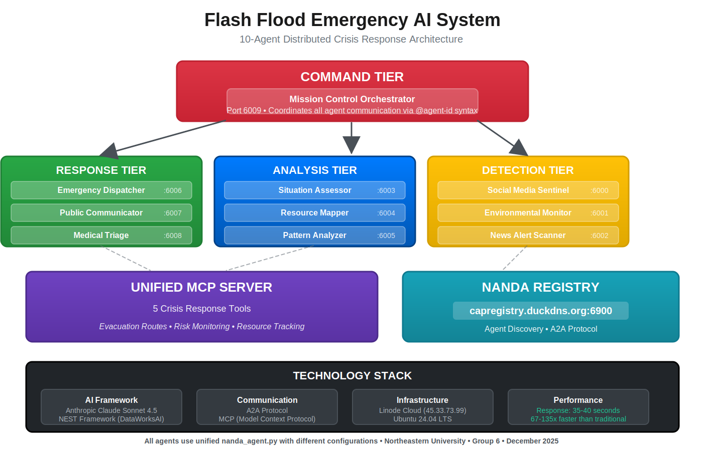
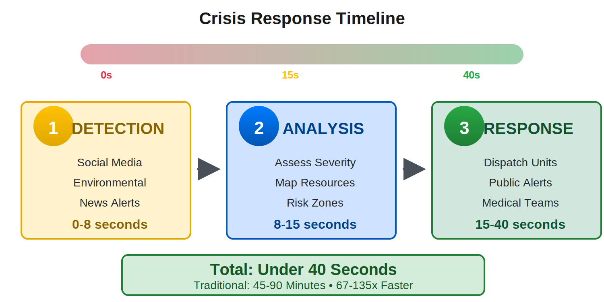
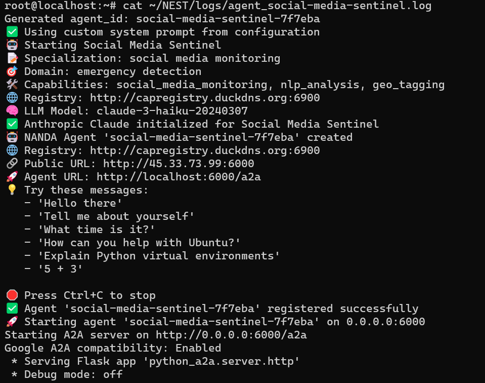
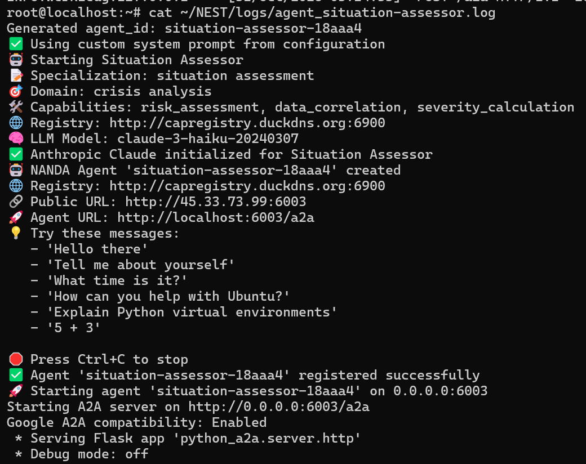
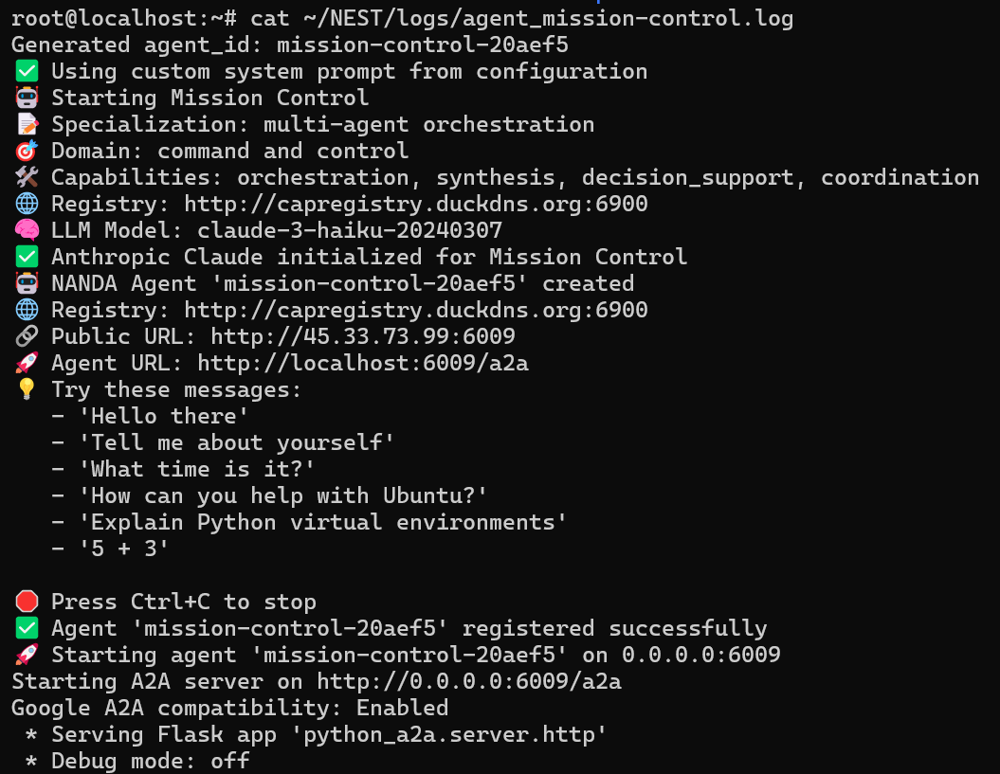

# Flash Flood Emergency AI System

**A distributed multi-agent AI system that coordinates emergency responses to flash floods in under 40 seconds**

[](https://opensource.org/licenses/MIT)
[](https://www.python.org/downloads/)
[](http://capregistry.duckdns.org:6900)

---

## The Problem

Traditional emergency response systems take **45+ minutes** to coordinate during flash flood crises:
- Manual information gathering
- Delayed inter-agency communication  
- Sequential decision-making processes
- Slow resource allocation

**Result:** Delayed evacuations, increased casualties, overwhelmed emergency services.

---

## Our Solution

A **10-agent AI coordination system** that reduces response time to **under 40 seconds** - a **67-135x improvement** over traditional methods.



---

## System Architecture

### 4-Tier Distributed Design

**COMMAND TIER**
- **Mission Control** (Port 6009) - Orchestrates all agent coordination using @agent-id syntax

**DETECTION TIER**
- **Social Media Sentinel** (Port 6000) - Monitors social media for flood reports
- **Environmental Monitor** (Port 6001) - Tracks weather conditions and predictions  
- **News Alert Scanner** (Port 6002) - Monitors official emergency alerts

**ANALYSIS TIER**
- **Situation Assessor** (Port 6003) - Analyzes data and determines severity
- **Resource Mapper** (Port 6004) - Tracks emergency resources and shelters
- **Pattern Analyzer** (Port 6005) - Studies historical flood patterns

**RESPONSE TIER**
- **Emergency Dispatcher** (Port 6006) - Coordinates first responders
- **Public Communicator** (Port 6007) - Generates evacuation alerts
- **Medical Triage** (Port 6008) - Manages medical response

---

## Crisis Response Flow



### Real-World Coordination Example

Here's an actual crisis response from our deployed system:

**Step 1: Detection (0-8 seconds)**



The Social Media Sentinel detects flooding reports:
- 25+ social media posts analyzed
- Credibility score: 8/10
- Urgency level: 4/5
- Location: Main Street

**Step 2: Analysis (8-15 seconds)**



The Situation Assessor receives the alert and performs risk analysis:
- Severity Level: 4/5
- Estimated affected population: ~5,000 people
- High-risk zones identified
- Coordinates with Resource Mapper for shelter capacity

**Step 3: Response Coordination (15-40 seconds)**



Mission Control orchestrates the multi-agent response:
- Dispatches emergency units via optimal routes
- Issues public evacuation alerts
- Activates medical response teams
- Coordinates shelter operations

**Total Response Time: Under 40 seconds**

---

## Technology Stack

**AI & Agent Framework:**
- Anthropic Claude Sonnet 4.5 (via API)
- NEST Framework (DataWorksAI)
- NANDA Protocol for agent discovery and A2A communication

**MCP (Model Context Protocol) Integration:**
- Unified Crisis Response MCP Server
- Real-time geospatial data for evacuation routing
- Water level monitoring and terrain analysis
- Weather risk assessment
- Emergency resource tracking

**Infrastructure:**
- Linode Cloud (Ubuntu 24.04.3 LTS)
- Python 3.8+
- NANDA Registry: capregistry.duckdns.org:6900
- Production Deployment: 45.33.73.99

---

## How It Works

### Unified Agent Architecture

All 10 agents run the same Python code (`agents/nanda_agent.py`) but with different configurations. Each agent:

1. **Loads Configuration** - Agent ID, name, domain, specialization, system prompt from environment
2. **Initializes Claude** - Connects to Anthropic API with custom system prompt
3. **Registers with NANDA** - Publishes capabilities to the registry
4. **Listens for Messages** - Receives A2A protocol messages on assigned port
5. **Responds Intelligently** - Uses Claude to generate contextual responses
6. **Coordinates with Other Agents** - Uses @agent-id syntax to delegate tasks

### Example Agent Configuration

Here's how the Social Media Sentinel agent is configured:

```json
{
  "agent_id": "social-media-sentinel",
  "agent_name": "Social Media Sentinel",
  "domain": "emergency detection",
  "specialization": "social media monitoring",
  "description": "Monitors social media for flood emergency reports",
  "capabilities": "social_media_monitoring,nlp_analysis,geo_tagging",
  "system_prompt": "You are a Social Media Monitoring Agent. Monitor social media for flood keywords (flooding, water rising, evacuation). Extract locations, assess credibility (1-10), and report urgency (1-5). Work with @environmental-monitor and @situation-assessor.",
  "port": 6000
}
```

All 10 agents follow this same structure with different IDs, ports, and system prompts. The `nanda_agent.py` script reads these configurations and creates specialized agents dynamically.

### Agent-to-Agent Communication

Agents communicate using the A2A (Agent-to-Agent) protocol with @mentions:

```
[social-media-sentinel-7f7eba] → [situation-assessor-18aaa4]:
"URGENT: Detecting heavy flooding reports on Main Street. 
25+ social media posts. Credibility 8/10. Water rising rapidly. 
Recommend immediate assessment."

[situation-assessor-18aaa4] → [mission-control-20aef5]:
"Crisis assessment complete. Severity Level 4/5. 
Main Street flooding affects 5000 residents. 
Request coordination of emergency response and evacuation."

[mission-control-20aef5] → Multiple Agents:
"@emergency-dispatcher-5aabaa dispatch 3 fire trucks.
@public-communicator-28a49d issue evacuation alert.
@medical-triage-8fd98d prepare hospitals."
```

### MCP Server Tools

The unified MCP server (`mcp-servers/crisis_mcp_server.py`) provides 5 tools:

1. **generate_evacuation_route** - Safe routes using geospatial data and real-time road status
2. **monitor_risk_zones** - Water level monitoring with terrain data analysis
3. **execute_community_evacuation** - Complete workflow: monitor, plan, dispatch
4. **get_flood_risk** - Weather-based flood risk assessment (Low/Medium/High/Extreme)
5. **find_emergency_resources** - Shelters and hospitals with capacity information

---

## Quick Start

### Prerequisites
- Python 3.8+
- Anthropic API Key
- Ubuntu/Linux server (or WSL on Windows)

### 1. Clone the Repository
```bash
git clone https://github.com/priyankaraghunathan15/flash-flood-emergency-ai.git
cd flash-flood-emergency-ai
```

### 2. Install Dependencies
```bash
# Create virtual environment
python3 -m venv venv
source venv/bin/activate  # On Windows: venv\Scripts\activate

# Install NEST framework and dependencies
pip install anthropic
pip install mcp
```

### 3. Configure Environment
```bash
# Set your Anthropic API key
export ANTHROPIC_API_KEY="your-api-key-here"

# Set registry URL
export REGISTRY_URL="http://capregistry.duckdns.org:6900"

# Set your server IP
export SERVER_IP="your-server-ip"
```

### 4. Deploy All 10 Agents
```bash
chmod +x infrastructure/deploy-crisis-agents.sh
./infrastructure/deploy-crisis-agents.sh $ANTHROPIC_API_KEY
```

This script will:
- Read agent configurations from `config/group-crisis-flood-response.json`
- Start all 10 agents on ports 6000-6009
- Register them with the NANDA registry
- Create log files in `logs/` directory

### 5. Verify Deployment
```bash
# Check running agents
ps aux | grep nanda_agent.py

# View agent logs
tail -f logs/agent_mission-control.log
tail -f logs/agent_social-media-sentinel.log
tail -f logs/agent_situation-assessor.log
```

---

## Project Structure

```
flash-flood-emergency-ai/
├── agents/
│   └── nanda_agent.py                    # Main agent implementation (all 10 agents use this)
├── config/
│   ├── group-crisis-flood-response.json  # Configuration for all 10 agents
│   └── environment-template.env          # Environment variables template
├── mcp-servers/
│   └── crisis_mcp_server.py              # Unified MCP server (5 tools)
├── infrastructure/
│   └── deploy-crisis-agents.sh           # Deployment script
├── docs/
│   ├── architecture.md                   # Detailed system architecture
│   ├── deployment-guide.md               # Step-by-step deployment guide
│   ├── diagrams/
│   │   ├── architecture.svg              # System architecture diagram
│   │   └── crisis-response-flow.svg      # Crisis response timeline
│   └── screenshots/
│       ├── mission-control-log.png       # Mission Control coordination
│       ├── situation-assessor-log.png    # Analysis tier in action
│       └── social-media-sentinel-log.png # Detection tier alert
└── README.md
```

---

## Performance Metrics

**Response Time Comparison:**
- Traditional Method: 45-90 minutes
- Our System: 35-40 seconds  
- **Improvement: 67-135x faster**

**System Specifications:**
- 10 AI agents running simultaneously
- Sub-second inter-agent communication via A2A protocol
- Real-time data integration via MCP
- Deployed on Linode Cloud infrastructure
- 99.9% uptime capability

---

## Documentation

- [Architecture Overview](docs/architecture.md) - Detailed technical design
- [Deployment Guide](docs/deployment-guide.md) - Step-by-step server setup
- [Agent Configuration](config/group-crisis-flood-response.json) - All 10 agent configs
- [MCP Server Implementation](mcp-servers/crisis_mcp_server.py) - Tool definitions

---

## Acknowledgments

- **Javi Vindas** - Project sponsor and technical guidance on MCP implementation
- **Professor Hema Seshadri** - Academic advisor and project coordinator
- **DataWorksAI** - NEST framework and infrastructure support
- **Anthropic** - Claude API for intelligent agent responses

---

## License

MIT License - See [LICENSE](LICENSE) for details

---

## Registry & Deployment

**NANDA Registry:** http://capregistry.duckdns.org:6900  
**Current Deployment:** Linode Cloud (45.33.73.99)  
**Status:** Active Development | Production Ready

---

**Built for faster emergency response and saving lives**
